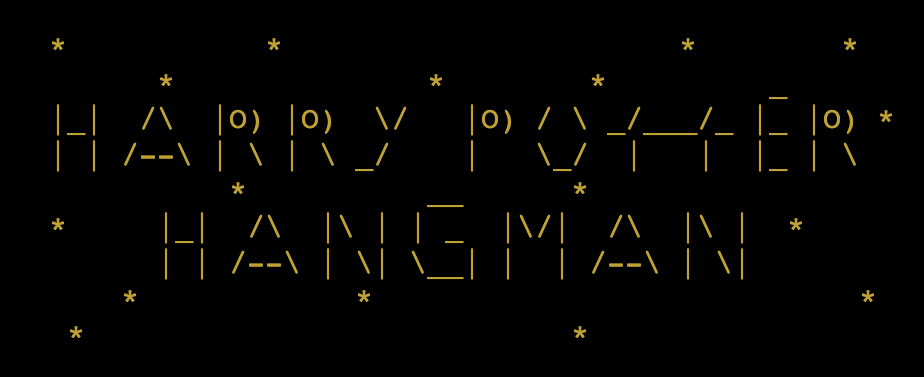
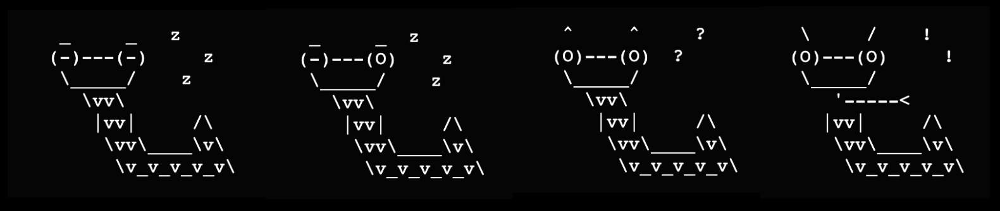
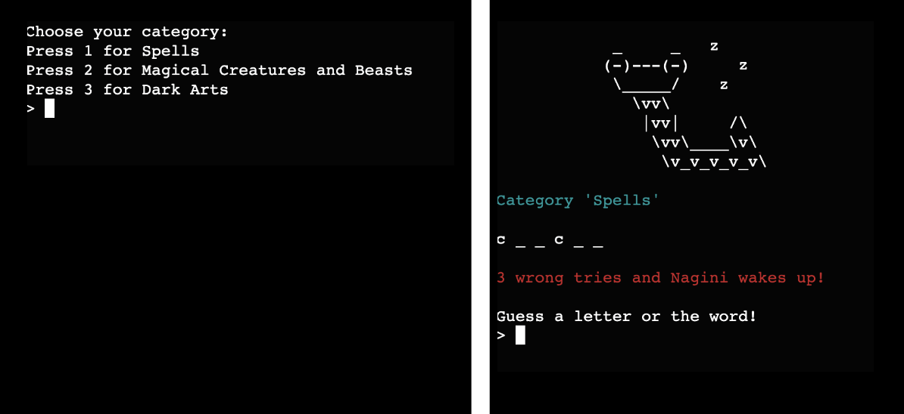
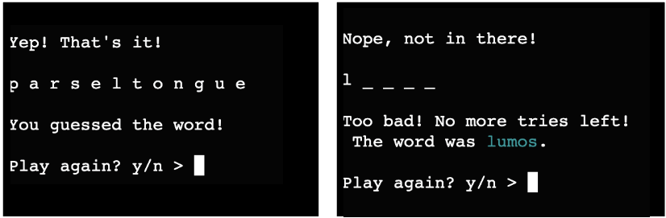
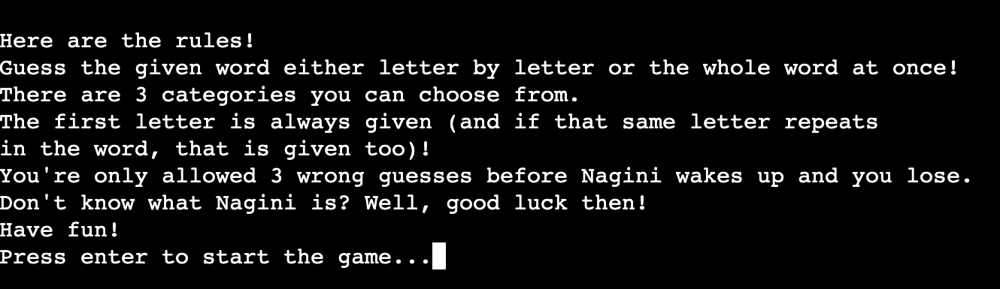

<h2 align="center">Harry Potter Hangman</h2>

[Find the project here](https://hp-hangman-ce63faba4c2f.herokuapp.com/).

This is a simple word guessing game. Players can guess the word letter by letter or the whole word at once. If they make 3 wrong guesses, they lose. All the words are related to the Harry Potter books. 

## User Experience (UX)

-  ### Site Owner's Goals

- The game should test the player's knowledge about Harry Potter books.
- The game should give simple and clear instructions.
- The game should include some visuals and colors to make it more appealing.
- The game should be interactive so players don't lose interest in playing.
- The game should run smoothly.

-  ### Player's Goals

- The game should be fun to play.
- Players should see the correct answer even if they lose.
- There should be a a limited amount of guesses to make it more fun and challenging.
- The game should run smoothly.

-  ### Design

To make it more fun and appealing for the players I have added some visuals and colors. 
- The title:

- Instead of the classic hangman image I designed an image of a snake that is sleeping and gradually wakes up if the player makes 3 wrong guesses:

- I have also added some color to the text.

## Features

The game presents the player with a random word to guess depending on the chosen category. There are three categories the player can choose from:

The player can make 3 wrong guesses before they lose the game. In addition to the sleeping snake (described above) there is a message displayed keeping track of available attempts.

If the player guesses a letter correctly, the game continues until the word is guessed or they lose. If the player inputs the same letter or the same word repeatedly, the score stays the same and they continue guessing.
When the player guesses the word or loses, they can choose to play again or stop playing:

If they choose to play again, they can pick a new category and play the new random word.
Game rules are presented before starting the game. Only when the player presses "enter" the game starts:

## Future Adaptations

The game can potentially grow by adding more words to it. Either to the same categories or adding more categories and word lists. 

## Technologies Used

1. [Python:](https://en.wikipedia.org/wiki/Python_(programming_language))
    Python was used as the programming language.
1. [Git:](https://git-scm.com/)
    Git was used for version control by utilizing the Gitpod terminal to commit to Git and Push to GitHub.
1. [GitHub:](https://github.com/)
    GitHub is used to store the projects code after being pushed from Git.
1. [Heroku:](https://heroku.com/)
    Heroku is used to host the deployed page.

## Testing and bugs

- The code has been passed through a PEP8 linter provided by Code Institute, no errors were found.  

- Friends were asked to review the site and give feedback.

- No bugs are present.

## Deployment

### Heroku

The project was deployed to [Heroku](https://heroku.com/). Steps for deployment:
1. Fork or clone this repository
2. Create a new Heroku app
3. Set the buildbacks to Python and NodeJs in that order
4. Add to Config Vars - key: PORT, value: 8000 
5. Link the Heroku app to the repository
6. Click on Deploy

### Local Deployment

This project can be cloned or forked to make a local copy. 
Steps:
- Log in to your Github.
- Find the [Harry Potter hangman repository](https://github.com/lienebriede/harry-potter-hangman).

For Cloning: 
- Click on "Code" and select either HTTPS, SSH or GitHub CLI, copy the link to your clipboard.
- Open Terminal.
- Change the current working directory to the location where you want the cloned directory.
- Type "git clone" and paste the URL you copied earlier.
- Press Enter to create your local clone. 

For Forking:
- Click on "Fork" (top-right corner).
- 

## Credits

#### Code

I was inspired to develop this game by making a simple version of it during the course [100 days of Python by Replit](https://replit.com/learn/100-days-of-python). 

Bits of code were learnt and applied from [Stack Overflow](https://stackoverflow.com/) and Youtube.

#### Content

All content was written by the developer.
